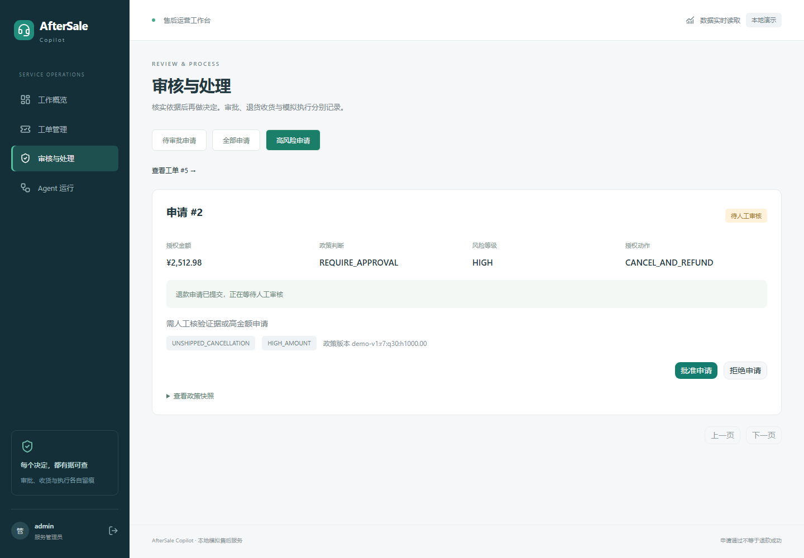
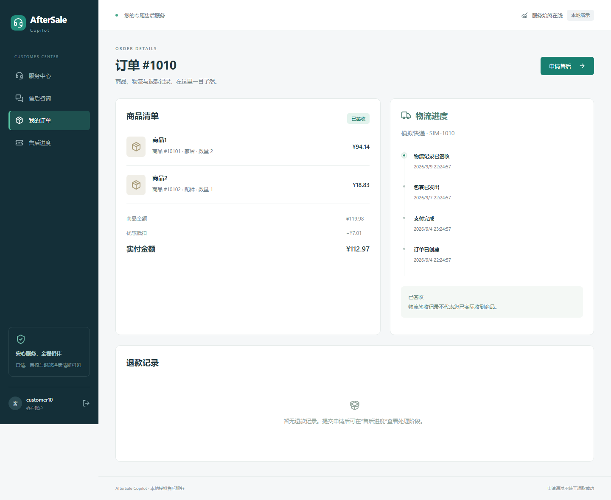
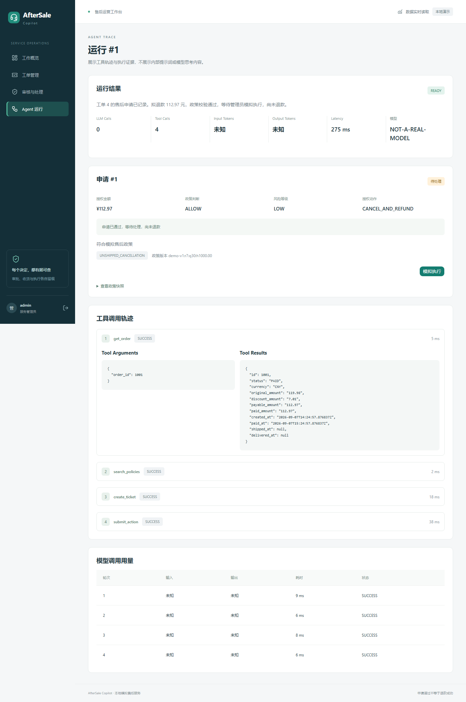

# AfterSale Copilot

电商售后 Web 产品：客户查询订单、物流和售后进度，通过单 Agent 发起申请；管理员核验政策、审批、确认退货收货、模拟执行并查看运行轨迹。

## 业务流程

客户通过聊天描述售后诉求，系统查询订单、商品、物流和政策；信息不足时主动补问，信息齐全后创建工单并提交售后申请。后端根据订单状态、售后期限、退款额度和风险规则决定处理路径。

| 场景 | 处理方式 |
|---|---|
| 未发货取消 | 校验订单和可退金额，生成取消退款申请 |
| 高金额退款 | 进入人工审批，由管理员核验后处理 |
| 退货退款 | 记录申请，等待退货收货确认 |
| 签收未收到 | 创建物流调查工单 |
| 信息不足 | 补问订单、商品或数量 |
| 越权或违规请求 | 拒绝跨用户访问及未经授权的操作 |

客户门户提供订单详情、物流时间线、聊天和售后申请状态。管理员工作台提供审批、收货确认、模拟执行、运行轨迹与请求量、Token、延迟等统计。

申请状态区分待处理（READY）、待审批（WAITING_APPROVAL）、待退货（WAITING_RETURN）、成功（SUCCESS）和拒绝（REJECTED）。申请通过、管理员批准与退款成功是不同阶段。

## 页面示例

以下为应用实际页面截图，订单和申请来自隔离的模拟业务数据库；对话使用脚本模型驱动，用于展示业务流程。真实 DeepSeek 评测结果见下方“模型评测”。

### 客户申请取消退款

客户选择订单并描述诉求，页面展示后端核定的退款金额和申请状态。示例中 ¥112.97 的申请已记录，等待处理，尚未退款。


### 高金额申请人工审批

管理员查看授权金额、风险等级和命中规则，再批准或拒绝申请。示例中 ¥2,512.98 的申请因高金额进入人工审核。



<details>
<summary>查看订单详情、运营统计和工具轨迹</summary>

### 订单与物流

商品明细、优惠、实付金额和物流时间线集中展示；物流签收记录与客户实际收货分别处理。



### 运营工作台

请求量、人工审核和调用用量从数据库记录汇总。截图是脚本演示数据，不能作为真实模型的性能或用量指标。


### 工具调用与政策依据

管理员可检查工具参数、返回结果和政策决策。示例模型标识为 NOT-A-REAL-MODEL；实际模型用量不从这些截图推算。



</details>

## 权限与业务约束

- 模型负责理解需求和选择工具；PolicyEngine 判断政策许可，RefundCalculator 计算退款金额，WorkflowService 管理业务状态和幂等。
- 客户只能访问自己的订单和工单；管理员权限在后端校验。
- Agent 没有审批、收货确认或退款执行权限，这些操作由管理员发起。
- 相同请求使用幂等键重试，避免重复创建业务记录和重复占用退款额度。
- 订单、物流和资金操作使用本地模拟数据，未接入真实支付渠道。

## 技术栈

后端：Python、FastAPI、SQLAlchemy、SQLite、LangGraph、DeepSeek API。前端：Next.js、React、TypeScript、Tailwind CSS、shadcn/ui。前后端接口类型通过 OpenAPI 生成。

## 本机启动

完成下方安装步骤后，在项目根目录设置登录账号。密码由使用者自行设置，没有预置通用密码。

```powershell
# 在克隆后的项目根目录执行
.\.venv\Scripts\python.exe scripts/setup_accounts.py
```

默认依次设置 `customer1`、`customer3`、`customer4`、`customer6`、`customer10` 和 `admin` 的独立密码，长度 12–128 个字符；输入不回显，只保存加盐哈希。再次执行保留已有账号。可用 `--user-id 1 2` 指定需要开通的客户。必须先有相应模拟业务用户，不提供公共注册入口。

然后打开两个 PowerShell 终端：

```powershell
# 终端 1：FastAPI
# 在克隆后的项目根目录执行
.\scripts\start.ps1
```

```powershell
# 终端 2：Next.js
# 在克隆后的项目根目录执行
.\scripts\start_frontend.ps1
```

打开 **http://127.0.0.1:3000**，使用刚设置的账号登录。管理员自动进入运营工作台。两个终端各按 Ctrl+C 停止对应服务。

脚本若受系统执行策略限制，可分别直接执行 `.\.venv\Scripts\python.exe -m uvicorn app.main:app --host 127.0.0.1 --port 8000 --no-proxy-headers` 和在 `frontend` 中执行 `npm run start`，无需改全局策略。

后端文档：http://127.0.0.1:8000/docs；健康检查：http://127.0.0.1:8000/health。业务 API 通过服务端登录会话鉴权。

## 从零安装或更新构建

验证环境：Windows 11、Python 3.13.5、Node.js 24.15.0、npm 11.12.1。建议沿用此组合；依赖版本由两个 lock 文件固定。

```powershell
python -m venv .venv
.\.venv\Scripts\python.exe -m pip install -r requirements.lock
.\.venv\Scripts\python.exe -m pip install --no-deps -e .
.\.venv\Scripts\python.exe -m app.cli init-db
.\.venv\Scripts\python.exe -m app.cli seed
.\.venv\Scripts\python.exe scripts/setup_accounts.py
Set-Location frontend
$env:npm_config_cache = "$env:LOCALAPPDATA\npm-cache"
npm ci
npm run build
```

首次安装将 `.env.example` 复制为 `.env`；已有配置不要覆盖。旧数据库升级可以运行 `scripts/upgrade_stage4.py`：先备份，再增量建表并校验原记录不变。

## 模型与身份配置

在项目根目录 `.env` 设置 `ASC_LLM_BASE_URL`、`ASC_LLM_MODEL`、`ASC_LLM_API_KEY`。密钥仅后端读取，不放入任何 `NEXT_PUBLIC_*` 变量。修改后重启后端。未配置模型会明确返回不可用结果。

前端通过同源 `/api/*` 代理请求 FastAPI，后端地址默认 `http://127.0.0.1:8000`；需要改变时配置 Next.js 运行环境 `BACKEND_URL`。`ASC_FRONTEND_ORIGINS` 控制允许的浏览器来源。当前服务只绑定本机，HTTP 下 `ASC_COOKIE_SECURE=false`；对外部署需另行完成 HTTPS 与部署加固。

账户采用 scrypt 密码哈希，12 小时随机服务端会话，HttpOnly / SameSite=Strict Cookie，写操作校验 CSRF 和来源。用户归属及 admin 权限由后端判断。Trace 仅管理员可见，HTTP 输出过滤 system 消息及 reasoning_content。

## PowerShell API 使用

```powershell
$auth = .\scripts\login.ps1
.\scripts\chat.ps1 -Session $auth.Session -CsrfToken $auth.CsrfToken `
  -OrderId 1001 -Message '请取消订单1001并退款' -OutputPath .\data\chat.json
# Trace 需要另行使用 admin 登录
$admin = .\scripts\login.ps1
.\scripts\trace.ps1 -Session $admin.Session -RunId 2 -OutputPath .\data\run-2-trace.json
```

脚本显式使用 UTF-8 解码和保存 JSON，兼容 Windows PowerShell 5.1。续聊添加 `-ParentRunId`；同一次不确定请求重试应复用 `-IdempotencyKey`。`scripts/demo.ps1` 会分别提示登录 customer6 和 admin，再演示高额申请及模拟执行。

## 验证与类型生成

```powershell
.\.venv\Scripts\python.exe scripts/verify.py
.\.venv\Scripts\python.exe scripts/export_openapi.py
Set-Location frontend
npm run generate:api
npm run test
npm run lint
npm run build
npx playwright install chromium
Set-Location ..
.\.venv\Scripts\python.exe scripts/run_stage4_e2e.py
```

已记录的回归结果：后端 173 项测试、前端 5 项测试和 8 项浏览器 E2E 均通过；另有 28 个政策案例、16 个离线 Agent 案例及两组 HTTP 冒烟。浏览器脚本临时创建数据库，在 8014/3810 启动测试服务，结束后停止服务；脚本模型标识 `NOT-A-REAL-MODEL`，不读取日常 API 密钥，也不改日常订单。它验证产品集成，不代表模型理解能力。

## 模型评测

评测集包含 125 条合成售后场景，覆盖 25 类业务、歧义和权限攻击；开发集 75 条，测试集 50 条。冻结测试集单次真实 DeepSeek API 评测结果如下：

| 指标 | 结果 |
|---|---|
| 任务成功率 | 92%（46/50） |
| 工具选择准确率 | 98%（49/50） |
| 实际越权、政策绕过、重复副作用 | 测试中均未观察到 |

这些指标来自本地合成场景，不代表生产客户成功率。4 个失败保留了完整分析，涉及退款进度回复、重复退款决策记录和补问类型。每次调用记录模型标识、配置与数据集 hash、工具轨迹、Token 和延迟。

[评测结果](docs/STAGE5_EVALUATION.md) · [失败分析](docs/STAGE5_FAILURE_ANALYSIS.md) · [评测与回归记录](docs/verification/stage5) · [页面截图](docs/verification/stage4)

接口契约变动后同时更新 `frontend/openapi.json` 与 `frontend/src/lib/generated.ts`。

## 代码入口

- `backend/app/api/`：业务路由、鉴权依赖、Auth 与 Portal 接口。
- `backend/app/services/`：政策、金额、工作流及账户/门户服务。
- `backend/app/repositories/` / `models/`：数据库访问与约束。
- `backend/app/agent/`：单 Agent、受限工具、模型适配和政策检索。
- `frontend/src/components/`：登录与应用框架、客户门户、管理员工作台、shadcn Button。
- `frontend/src/app/`：页面路由与同源 API 代理；`frontend/e2e/`：浏览器测试。

- [评测数据集](eval/stage5/)：冻结的 Dev/Test 场景与 manifest。
- [评测脚本](scripts/stage5.py)：隔离评测、评分与调用账本；[运行记录](docs/verification/stage5/)：版本快照、完整轨迹与实测结果。

页面与鉴权设计见 [产品与权限说明](docs/STAGE4_HANDOFF.md)，演示流程和代码阅读顺序见 [项目说明](docs/STAGE5_PORTFOLIO.md)。
