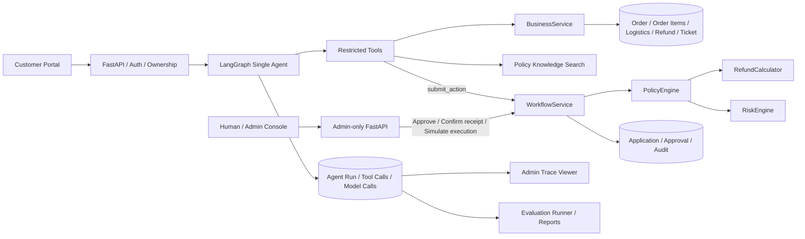
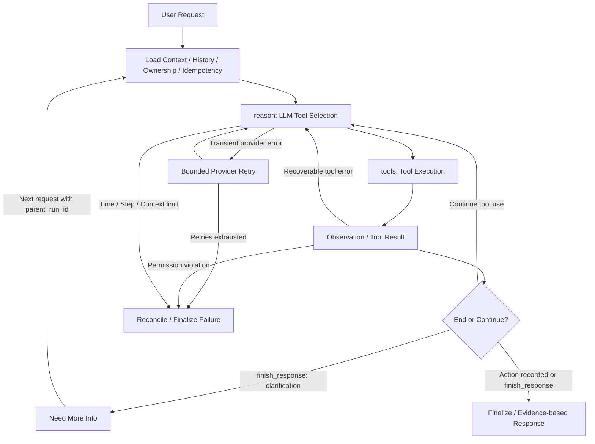

# AfterSale Copilot

A production-style after-sales AI Agent with stateful workflow, deterministic policy guardrails and evaluation-driven optimization.

面向退款、物流异常与高风险审批场景的智能售后 Agent，重点探索 Agent 自主决策、业务安全边界与真实模型评测。

**LangGraph · DeepSeek · FastAPI · Next.js · Agent Evaluation**

| Metric | Result |
|---|---|
| Frozen Test Task Success | **92.0% (46/50)** |
| Tool Selection Accuracy | **98.0%** |
| Required Tool Recall | **99.3%** |
| Evaluation Cases | **125 / 25 scenario types** |
| Backend Regression Tests | **173 passed** |

Metrics are measured on frozen synthetic after-sales evaluation scenarios, not production traffic.

“Production-style” 指业务分层、权限与审计设计；订单、物流和资金操作均为本地模拟，未接入真实支付渠道。

## Why AfterSale Copilot

- **Stateful Agent Workflow** — 使用 LangGraph State、Conditional Edge 和循环串联需求理解、Tool Calling、Observation 与继续决策，支持多轮补问。
- **Deterministic Safety Boundary** — LLM 负责理解与工具规划；PolicyEngine / RefundCalculator / WorkflowService 负责政策、金额和业务状态，审批与执行由管理员发起。
- **Evaluation-driven Development** — Test 不参与调参；依据 failure attribution 优化 Prompt 与 Tool Description，Dev Task Success 从 **84.0% 提升至 93.3%**。
- **Full-stack Productization** — Customer Portal、Admin Console、Dashboard、Trace Viewer、登录鉴权和浏览器 E2E 形成可演示的业务闭环。

## Architecture



**LLM cannot approve, confirm receipt or execute refunds directly.** Agent 只提交候选动作；WorkflowService 在事务内调用政策引擎并记录决策，管理员通过独立鉴权接口审批、确认收货或模拟执行。

商品信息来自订单商品项，没有独立商品目录服务。政策检索提供引用证据，业务许可仍由确定性规则判断。代码入口：[Agent runtime](backend/app/agent/runtime.py)、[受限工具](backend/app/agent/tools.py)、[业务工作流](backend/app/services/workflow.py)。

## Agent Workflow



图中 `reason`、`tools` 是实际 LangGraph 节点，其余表示节点内部或图外的处理步骤。普通工具错误可作为 Observation 返回模型；越权、预算上限和不可恢复错误终止运行。完成动作提交后结束本轮，最终回复由已验证证据和业务状态生成，不直接展示自由文本草稿。

多轮通过 `parent_run_id` 加载历史，不依赖长期 Memory。请求幂等键避免重复提交；结束时核对已持久化动作，不能通过重试再创建一笔退款。

## Product Screenshots

以下为应用真实页面截图，来自隔离的模拟业务数据库，对话由脚本模型驱动；截图不作为真实 DeepSeek 性能证据。

### Customer Portal / 售后对话


客户选择订单并申请取消，页面展示后端核定的 ¥112.97 退款申请及“尚未退款”状态。

### Admin Console / 高金额人工审批


¥2,512.98 的申请进入人工审核，管理员查看授权金额、风险与政策规则后作出决定。

### Agent Trace Viewer / Tool + Policy Trace


管理员检查工具参数、结果和政策依据；图中 NOT-A-REAL-MODEL 明确标识脚本演示，未报告用量显示为未知。

## Evaluation

**125 cases / 25 scenario types，Dev 75 / Test 50。** 覆盖取消退款、物流异常、退货、高金额审批、缺信息、多轮、边界、幂等、故障与权限攻击。

| 对照 | Task Success | 用途 |
|---|---|---|
| Baseline Dev | 84.0%（63/75） | 识别失败与建立基线 |
| Adopted Dev | 93.3%（70/75） | 验证 Prompt 和工具说明优化 |
| Frozen Test | 92.0%（46/50） | 版本冻结后单次正式评测 |

第二轮 Dev 降至 69/75，按预定标准回滚并采用第一轮。**Test 在最终版本冻结后正式运行一次，未用于调参，也未重跑替换成绩。** 两个集合共享商家规则与种子结构，不能将其视为真实客户分布下的独立泛化证明。

- Frozen Test Tool Selection Accuracy：**98.0%（49/50）**；Required Tool Recall：**99.3%**（适用案例的宏平均，分母与计算方法见报告）。
- 50 条 Test 中未观察到 **unauthorized access / policy bypass / duplicate side effect**；有限样本中的零次观察不代表绝对安全。
- **4 个 failure 全部保留并完成 failure attribution**：退款进度回复未覆盖状态（2 条）、重复退款未形成预期决策记录（1 条）、补问类型与标注存在歧义（1 条）。
- 每批记录 requested / returned model、时间、Prompt / 配置 / 代码 / 数据集 hash；逐调用保存 Token、延迟、工具轨迹与数据库变化。
- 工程回归记录：**173 项后端测试、5 项前端测试、8 项浏览器 E2E 通过**；脚本 E2E 与真实模型成绩分开统计。

[完整评测](docs/STAGE5_EVALUATION.md) · [Failure Analysis](docs/STAGE5_FAILURE_ANALYSIS.md) · [冻结数据集](eval/stage5/manifest.json) · [原始结果](docs/verification/stage5/stage5-final-v1-test/summary.json)

## Safety by Design

| Capability | LLM Agent | Deterministic Backend |
|---|---|---|
| Understand request | ✅ | — |
| Select tools | ✅ | 校验允许名单与参数 |
| Retrieve policy/order/logistics | ✅ via tools | ✅ 归属校验与数据访问 |
| Calculate refund amount | ❌ | ✅ RefundCalculator |
| Approve high-risk refund | ❌ | ✅ Human/Admin |
| Confirm returned goods | ❌ | ✅ Admin |
| Execute refund | ❌ | ✅ Simulated backend only |

服务端注入用户身份，工具参数不能自行指定身份、金额或状态。提交前必须查询订单和政策；商品售后必须查询相应商品项。客户仅能查看自己的订单和工单，Trace 仅管理员可见。

账号使用 scrypt 密码哈希和服务端会话，写操作校验 CSRF 与来源。金额占用、幂等和业务状态由事务与确定性服务控制。申请通过、人工批准、收货确认和退款成功分别记录，**申请通过不等于退款成功**。外部接口不展示 system prompt 或模型 reasoning_content。

## Tech Stack

| 层次 | 技术 |
|---|---|
| Agent | LangGraph、DeepSeek、受限 Tool Calling |
| Backend | Python、FastAPI、Pydantic、SQLAlchemy、SQLite |
| Frontend | Next.js、React、TypeScript、Tailwind CSS、shadcn/ui |
| Validation | pytest、前端组件测试、Playwright E2E、真实模型评测 |
| API Contract | OpenAPI 生成 TypeScript 类型 |

## Repository Structure

```text
backend/app/agent/       # Agent runtime, tools, model adapter
backend/app/services/    # Policy, refund, workflow services
backend/app/api/         # Auth and business APIs
eval/                    # Evaluation cases, including frozen Dev/Test
frontend/                # Customer/Admin web application
docs/                    # Evaluation, design, setup and screenshots
scripts/                 # Startup, account setup and evaluation commands
```

## Quick Start

首次使用先按 [安装与配置](docs/SETUP.md) 安装依赖、初始化模拟数据、配置 `.env` 并创建本地账号；没有预置通用密码。完成后，在项目根目录打开两个 PowerShell 终端：

```powershell
# Terminal 1: FastAPI
.\scripts\start.ps1
```

```powershell
# Terminal 2: Next.js
.\scripts\start_frontend.ps1
```

访问 **http://127.0.0.1:3000**，客户进入售后门户，管理员进入运营工作台。服务默认绑定本机；对外部署需 HTTPS 与部署加固。模型密钥仅由后端读取，未配置模型会返回不可用结果。

## Detailed Setup

[完整安装、环境配置与验证指南](docs/SETUP.md) 包含 Windows 依赖安装、数据库初始化、账户创建、PowerShell API、多轮与幂等参数、OpenAPI 类型生成和测试命令。

## Documentation

- [Evaluation Report](docs/STAGE5_EVALUATION.md)：指标、对照实验与统计口径。
- [Failure Analysis](docs/STAGE5_FAILURE_ANALYSIS.md)：完整失败与归因。
- [Product & Auth Design](docs/STAGE4_HANDOFF.md)：页面、权限和 API 设计。
- [Evaluation Protocol](docs/verification/stage5/PROTOCOL.md)：冻结与评测约束。
- [Demo & Code Reading Guide](docs/STAGE5_PORTFOLIO.md)：业务演示与代码阅读顺序。
