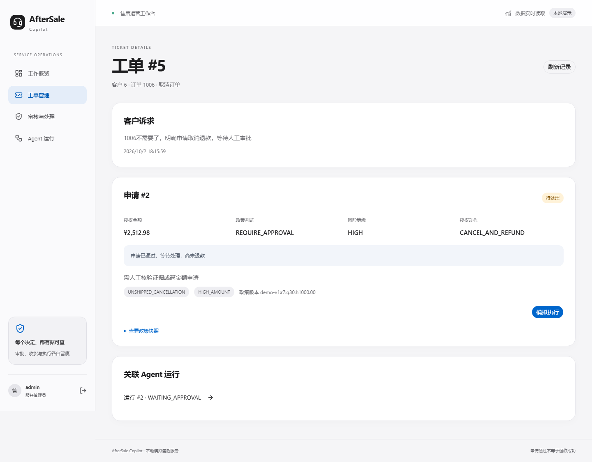

# 产品演示与启动指南

建议用 3–5 分钟讲解完整路径，再用 Trace 和冻结评测回答实现问题。订单、物流和退款均为模拟业务，**申请通过、人工批准与退款执行是三个不同阶段**。

## 已保存的实际演示

[浏览器录屏（WebM）](assets/portfolio-demo.webm) · [逐步截图与时间线](verification/portfolio-demo/walkthrough.json) · [浏览器断言结果](verification/portfolio-demo/e2e.json)

录屏来自当前实际 Web 应用，使用临时 SQLite、固定演示账号与 `NOT-A-REAL-MODEL` 脚本模型，无音频；不是 UI 概念图、真实模型成绩或真实支付。全过程按脚本快速演示，人工讲解时可逐步停留。测试账号及密码仅用于这个临时环境，不是日常数据库的登录凭据。

| 顺序 | 演示内容 | 面试讲解重点 |
|---|---|---|
| 1 | 客户订单 → 1001 取消申请 → 售后进度 | Agent 查询证据再提交；¥112.97 由后端计算，READY 尚未退款 |
| 2 | 1006 高金额申请 → 管理员待审批 | ¥2512.98 进入 WAITING_APPROVAL；Agent 不能批准 |
| 3 | 管理员批准 → 单独模拟执行 | 批准后仍是 READY；只有执行成功才显示模拟退款成功 |
| 4 | 打开取消申请的 Tool / Policy Trace | 受限工具、政策决策与调用记录可追溯，不展示 system prompt / reasoning |
| 5 | 1010 签收未收到 → 物流调查 | 物流异常不直接退款，进入调查 |
| 6 | 缺订单时补问 → 普通用户访问 Admin | 不猜订单；页面和后端 API 都拒绝越权 |



管理员批准后仍提示尚未退款，下一步由管理员单独发起模拟执行。

## 自己启动并演示

首次安装见 [SETUP](SETUP.md)，不要覆盖已有 `.env`。配置模型只在项目根目录 `.env` 中设置，密钥不放前端。日常使用真实模型会计费，录屏复现路径不会。

```powershell
# 项目根目录；创建缺少的账号，不更改已存在的密码
.\.venv\Scripts\python.exe -X utf8 scripts/setup_accounts.py --user-id 1 2 4 6 10

# 更新代码后生成生产前端构建
Set-Location frontend
npm run build
Set-Location ..
```

账号角色由后端绑定：`customer1` 对应 1001，`customer6` 对应 1006，`customer10` 对应 1010，`customer4` 用于补问，`customer2` 用于拒绝越权；`admin` 审批并查看 Trace。密码由本人设置，没有通用生产演示密码。

在两个 PowerShell 终端分别启动：

```powershell
# 终端一，在项目根目录
.\scripts\start.ps1
```

```powershell
# 终端二，在项目根目录
.\scripts\start_frontend.ps1
```

访问 **http://127.0.0.1:3000**；后端健康检查为 **http://127.0.0.1:8000/health**。更新模型配置后重启后端，更新前端构建后重启前端。两个终端各按 Ctrl+C 停止服务。

明确申请时取消“仅咨询，不提交申请”勾选；演示查询或咨询时保留勾选。刷新历史不会自动续聊，需点击“继续最近对话”。结果尚未确认时，先查询原请求，不换幂等键重复办理。

日常数据库可能已经有申请，不应重置它以获得漂亮演示结果。可以直接展示已存在记录；需要从头复现时用下面的独立脚本环境。

## 从头复现录屏（不调用付费模型）

安装 Playwright Chromium 后，在项目根目录执行；要求端口 8014 / 3810 空闲。运行器创建临时数据库，测试结束后停止服务，不影响日常订单。

```powershell
$env:E2E_OUTPUT_DIR = Join-Path $PWD "docs/verification/portfolio-demo-local"
$env:E2E_CONFIG = "playwright.demo.config.ts"
.\.venv\Scripts\python.exe -X utf8 scripts/run_stage4_e2e.py
Remove-Item Env:E2E_OUTPUT_DIR
Remove-Item Env:E2E_CONFIG
```

新截图和 `walkthrough.json` 写入指定目录，视频在 `browser-artifacts` 内。默认完整 E2E 使用原配置，专用演示不混入旧的 17 项验收记录。

## 讲解成绩与边界

- 历史冻结 50 条 Test 为 46/50；可靠性专项冻结 Holdout 为 25/26。数据和代码版本不同，不能直接作提分对照。
- 浏览器录屏验证完整产品集成；脚本模型不会证明自然语言理解能力。新的修复后模型验证单独记录实验版本及预算。
- 当前是有状态 Single-Agent Workflow；订单、金额、政策许可、审批和模拟执行由结构化工具与确定性后端承担，没有增加 RAG、Multi-Agent、MCP 或长期 Memory。
- 正式支付、外部物流/电商系统、生产部署及规模化运行不在现有能力范围内。

代码阅读：`backend/app/agent/runtime.py` → `tools.py` → `services/workflow.py` / `policy.py` / `calculator.py` → Auth / Portal API → `frontend/src/components/customer.tsx` / `admin.tsx` → 数据集和单条真实 trajectory。
