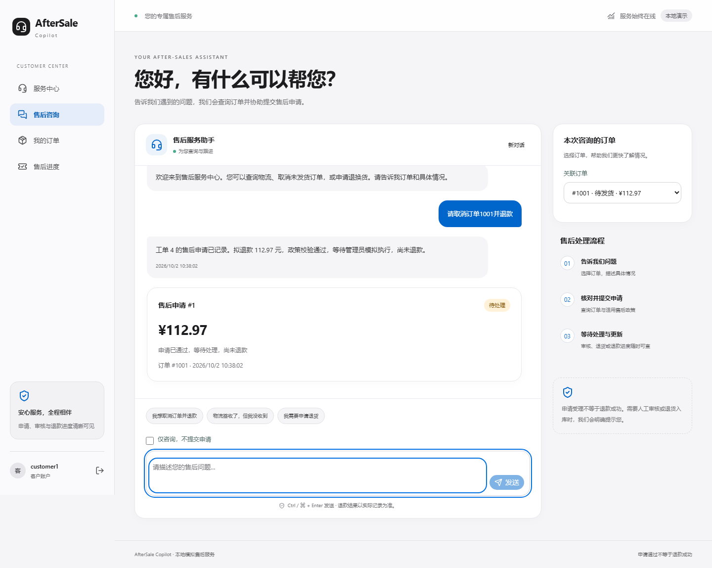
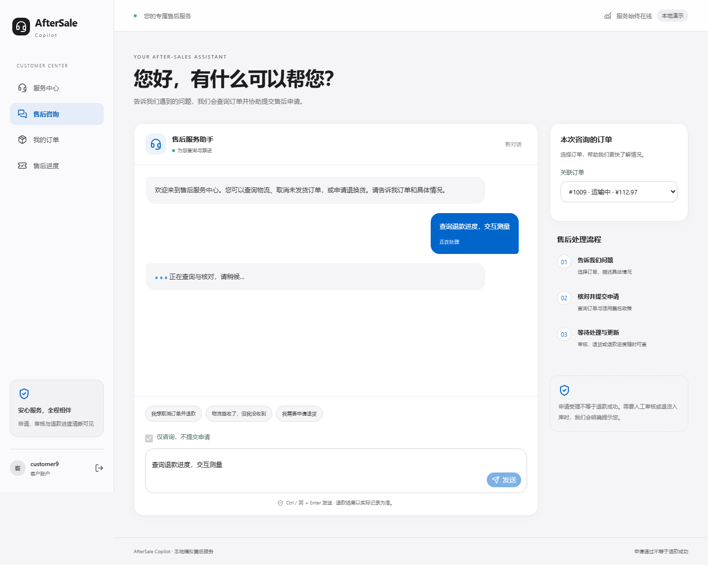
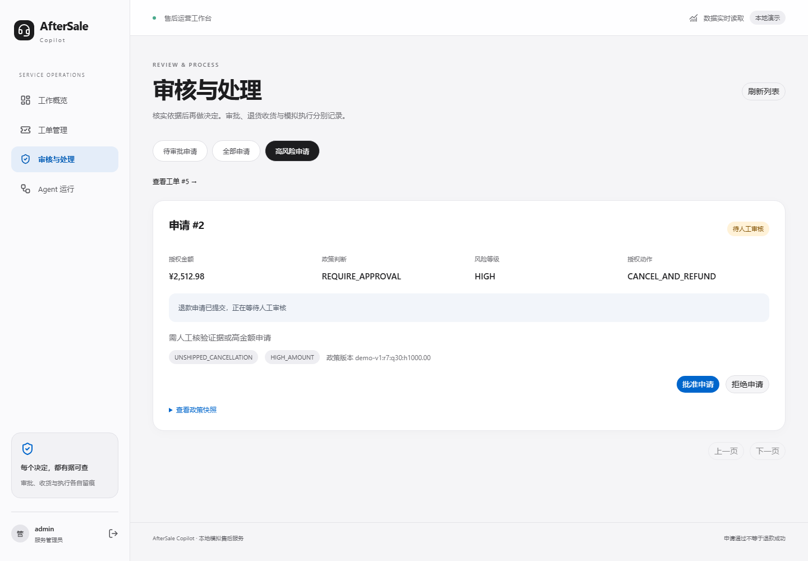
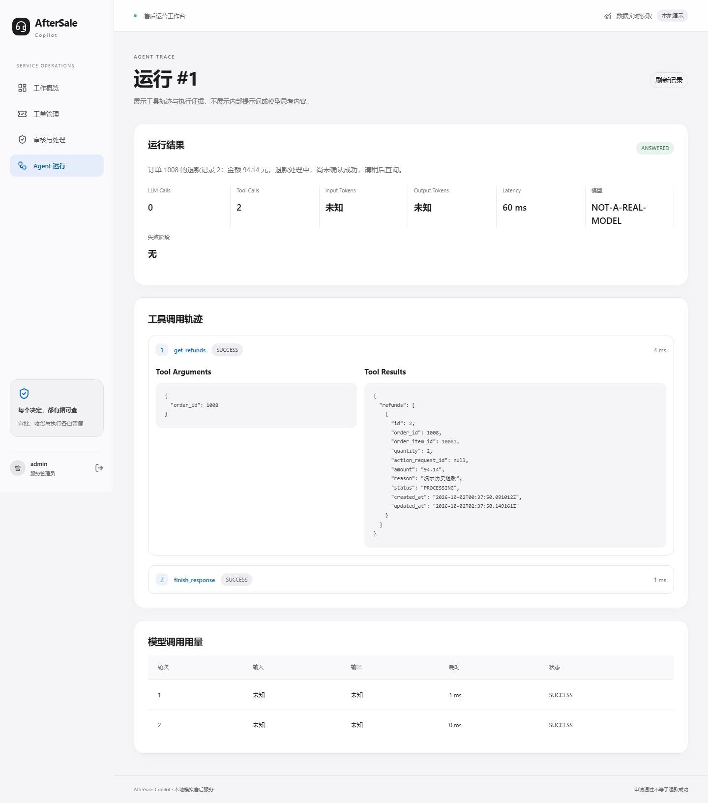
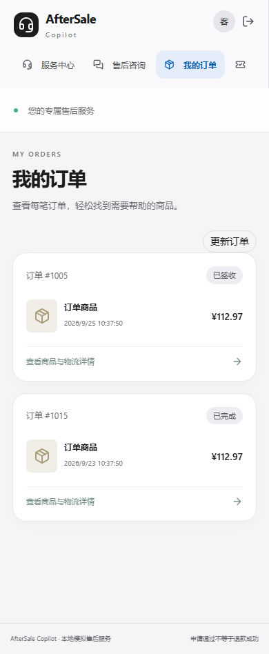

# 前端交互与流畅度优化

保留现有简洁视觉设计，优化客户对话、页面切换、数据刷新和管理员 Trace 展开。本轮没有修改后端业务规则、Agent、历史评测数据或模型实验结果，真实模型 API 调用为 **0**。

## 用户能感受到的变化

- **切页更连贯。** 登录工作区放在持久 Layout 中，导航不再反复销毁外壳和查询登录状态；客户与管理员页面按角色加载。首次加载、窗口重新聚焦、页面恢复可见或明确要求时仍核对会话，后端始终校验权限。
- **发送立即有反馈。** 用户消息马上显示，等待期间保留并锁定输入，明确标记正在处理或结果待确认。只有服务端验证后的回复和业务状态才显示为结果，不模拟退款成功，也不展示未验证模型文字。
- **阅读历史不被打断。** 接近底部才自动跟随消息；查看历史时保留滚动位置，提供“查看最新消息”。输入框自动增高，支持 Ctrl/Command + Enter，并避免输入法组合期间误发。低动态效果偏好会关闭动画。
- **刷新不中断阅读。** 保留上次记录，显示更新中或更新失败提示，订单、售后进度和管理员页面提供刷新入口。并发 GET 合并，最后一个订阅离开时取消读取；不保存已完成响应作为跨导航缓存。
- **等待可以恢复。** 离开对话取消浏览器等待，保留原请求、幂等键和已知运行编号；已知运行仅做 GET 查询。隐藏或离线时暂停轮询，恢复后核对服务端，不自动生成新的申请。
- **管理员详情更轻。** 折叠的 Tool Arguments / Results 不渲染详细 JSON，展开后才加载到 DOM。审批等操作防重复点击，业务记录刷新期间禁用旧状态操作，成功提示仍来自服务端。

账号或会话变化会清理读取作用域；过期读取不得污染新会话。新路径不会展示上一订单记录。未知 URL 继续返回 404，普通用户不能通过页面导航获得管理员权限。

## 前后对照

基线代码为 `603889b`；同一台 Windows 电脑、Chromium、1440 × 1000 视口、Next.js production build、本地隔离数据库和脚本模型。下表是受控浏览器探针，**不是生产性能或真实 DeepSeek 延迟指标**。

| 探针 | 基线 | 优化后 |
|---|---:|---:|
| 连续 5 次内部导航额外 `/auth/me` 请求 | 5 | 0 |
| 注入 1200 ms 响应等待后，150 ms 检查时用户消息可见 | 否 | 是 |
| 等待期间输入锁定 | 是 | 是 |
| 80 个受控 Tool Call 的初始 JSON 块数量 | 160 | 2 |
| 展开最后一个调用后的 JSON 块数量 | 160 | 4 |

80 个调用是人为注入的压力数据，不是实际 Agent 运行或能力展示；当前默认工具上限仍为 12。消息探针的观察耗时包含 Playwright 等待和执行开销，不能解释为首次绘制耗时。五次导航样本较少，不据此宣称普遍的百分比提速或帧率改善。

完整原始记录：[基线](verification/frontend-ux/baseline/source.json) · [优化版本](verification/frontend-ux/optimized/source.json) · [验收汇总](verification/frontend-ux/summary.json)。导航、消息、Trace 的逐项 JSON 分别保存在这两个版本目录中。

新增受控验证确认：61 条历史记录下刷新不抢滚动，跳转最新消息和 reduced-motion 生效；切离并恢复已知运行只有一次 POST，保留原运行；管理员登出后切换普通账号无法访问 Admin。

## 真实页面截图

以下为实际 Web 应用的浏览器截图，使用隔离模拟业务数据及 `NOT-A-REAL-MODEL` 脚本模型；不代表真实支付或新增真实模型评测。

### 客户售后对话



经服务端验证后展示申请状态，明确区分申请受理与退款成功。



慢响应时立即显示用户消息和等待状态，保留原输入。

### 高金额人工审批



高金额申请进入待审批队列，由管理员核对并操作。

### 管理员 Trace



首个调用展开，其余调用折叠；只展示允许公开的工具与业务记录。

### 移动端订单



390 px 视口的订单列表保持可读，刷新入口和导航可用。

## 验证结果

| 验证 | 结果 | 证据 |
|---|---|---|
| 前端组件与集成测试 | 23 passed（原 13 + 新增 10） | [JSON](verification/frontend-ux/component-tests.json) |
| 浏览器 E2E | 17 passed（原 11 + 新增 6） | [最终报告](verification/frontend-ux/optimized/e2e.json) |
| 后端回归 | 270 passed | [JUnit](verification/frontend-ux/backend-tests.xml) |
| TypeScript、ESLint、生产构建 | 全部通过 | [检查记录](verification/frontend-ux/checks.json) |
| 修改文件格式 | Prettier、运行器 Ruff 检查通过 | [汇总](verification/frontend-ux/summary.json) |

E2E 保留取消申请、高金额审批及模拟执行、物流调查、补问、越权和普通用户拒绝 Admin 等原场景，并新增交互探针。组件测试覆盖读取合并/取消、刷新失败保留内容、账号隔离、写入失效、发送反馈、轮询暂停和 Trace 按需渲染。

第一轮浏览器验证有一个测试在原生 `details` 的 React toggle 更新完成前读取 DOM 数量；改为等待同一个预期数量后通过，未放宽断言。[首次记录](verification/frontend-ux/first-e2e-attempt.json) 保留，最终报告另存。没有重跑或重写任何冻结模型 Test/Holdout。

## 代码入口

| 文件 | 用途 |
|---|---|
| [layout.tsx](../frontend/src/app/layout.tsx)、[portal.tsx](../frontend/src/components/portal.tsx) | 持久工作区、角色按需加载、会话核对 |
| [api.ts](../frontend/src/lib/api.ts)、[shared.tsx](../frontend/src/components/shared.tsx) | 读取取消与合并、会话作用域、保留记录刷新 |
| [customer.tsx](../frontend/src/components/customer.tsx) | 即时消息反馈、滚动与输入、已验证回复合并 |
| [run-polling.ts](../frontend/src/lib/run-polling.ts) | 可取消、隐藏/离线暂停的原运行 GET 轮询 |
| [admin.tsx](../frontend/src/components/admin.tsx) | Trace JSON 按需渲染、刷新状态与操作保护 |
| [interaction.css](../frontend/src/app/interaction.css) | 短动效、滚动与 reduced-motion |
| [interaction.test.tsx](../frontend/src/components/interaction.test.tsx)、[ux.spec.ts](../frontend/e2e/ux.spec.ts) | 新增组件验证与浏览器探针 |

没有新增依赖或状态管理框架；OpenAPI 类型和后端接口未修改。退款金额、PolicyEngine、审批、确认收货、模拟执行及幂等规则继续由既有后端决定，Agent 没有获得管理员能力。

## 复现与体验

常规安装及账号配置继续参考 [SETUP](SETUP.md)。本次已生成生产构建，已有服务需要重启前端后才能使用新构建。

```powershell
# 项目根目录，首次安装后或代码更新后
Set-Location frontend
npm run build
Set-Location ..
.\scripts\start_frontend.ps1
```

独立浏览器验证不读取日常订单数据库或调用真实模型；要求测试端口 8014 / 3810 空闲，结束后停止两个测试服务。使用新输出目录，避免覆盖既有证据：

```powershell
$env:E2E_OUTPUT_DIR = Join-Path $PWD "docs/verification/frontend-ux-local"
.\.venv\Scripts\python.exe -X utf8 scripts/run_stage4_e2e.py
Remove-Item Env:E2E_OUTPUT_DIR
```

## 范围与限制

- 优化发送反馈、导航与渲染负担；没有缩短真实模型计算时间，也没有新增后端异步任务或流式协议。
- 当前采用在途 GET 合并与组件当前快照，没有跨页面持久业务缓存；窗口重新聚焦会核对服务端。没有引入列表虚拟化或新的分页 API。
- 恢复沿用已有浏览器请求记录；跨设备、关闭整个会话后的恢复能力没有扩展。停止浏览器等待不代表后端业务取消。
- 桌面主流程及移动订单列表已验证，不宣称覆盖所有手机型号、长列表规模或网络环境。
- 原真实模型分数仅对应原冻结版本。本轮工程回归不构成新模型效果结论；没有加入 RAG、Multi-Agent、MCP 或复杂 Memory。

本轮交互优化验收完成，保留证据后停止。后续如需继续，先根据实际使用情况采集瓶颈，再决定是否需要异步执行、列表分页扩展或新模型实验。
