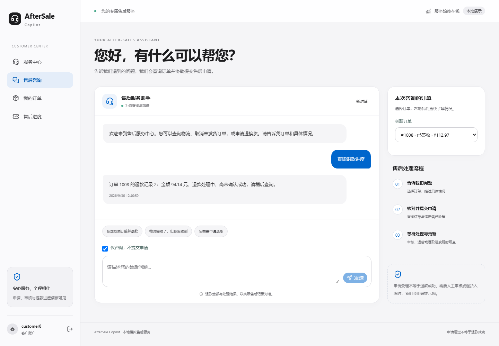

# 退款进度与咨询边界优化

本轮完成退款进度回复修复、显式咨询模式和意图补问契约。未引入 RAG、Multi-Agent 或新的业务审批能力。模型 API 调用为 **0**；以下工程验证不能替代真实模型评测。

## 行为变化

| 场景 | 改动前 | 当前行为 |
| --- | --- | --- |
| 查询退款处理中订单 | 工具返回退款记录，但最终回复可能只显示订单状态 | 保存经过权限校验的退款观察，按实际退款状态及金额生成回复 |
| 已退款成功 | 退款查询缺少专用回复路径 | 显示“退款成功（模拟），不代表真实资金到账” |
| 无退款记录 | 缺少专用说明 | 明确当前无退款记录，查询未提交新申请 |
| 只想咨询 | 主要依赖模型规划 | 用户可勾选“仅咨询，不提交申请”，后端拦截建单和提交工具 |
| 诉求含糊 | 与不支持请求共用 UNSUPPORTED | 新增 ASK_INTENT，先询问具体问题及咨询/办理意图 |

`get_refunds` 仍执行订单归属及本轮订单范围检查。`REFUNDS` 结束类型必须先实际查询退款记录，不能用模型草稿编造结果。旧 `ORDER` 结束类型在已查询退款时也补充退款状态，兼容旧规划路径。PENDING / APPROVED / PROCESSING / SUCCESS / REJECTED / FAILED 均有确定性中文文案。

## 咨询模式契约

`POST /agent/runs` 新增可选字段 `read_only: boolean`，严格布尔类型，默认 `false` 以兼容原客户端。

```json
{
  "message": "查询退款进度",
  "order_id": 1008,
  "read_only": true,
  "idempotency_key": "consultation-example-001"
}
```

- `true` 限制本轮 Agent 的 `create_ticket` 和 `submit_action`，返回 `CONSULTATION_ONLY` 工具观察，允许模型转为查询或补问。仍保存运行与审计记录；“只读”指不新增售后业务副作用。
- 标记由客户请求传入，工具 schema 不允许模型覆盖。普通查询继续遵守权限检查，管理员审批、收货和执行操作仍未暴露为 Agent 工具。
- 幂等键绑定该模式。相同请求可重试；同键更改模式返回冲突。默认 `false` 的请求保持旧版本哈希算法结果，避免升级后旧请求重试冲突。
- 前端失败重试沿用原请求，暂时锁定模式。新对话或切换关联订单会清除待重试请求。
- 本轮约束不会撤销之前的申请，也不是账户级权限；每轮请求独立指定。UI 在连续对话中保留勾选状态。

没有勾选咨询模式时，自然语言中的“能退款吗”等意图仍依赖模型识别。Prompt 已明确咨询不能建单，但**尚未通过新真实模型实验测量误提交率**。显式模式的确定性限制不等于自然语言识别已经完全可靠。

## 验证

| 检查 | 结果 |
| --- | --- |
| 后端 pytest | 190 passed（原 173 项 + 新增 17 项） |
| 前端组件/集成 | 6 passed |
| 浏览器 E2E | 9 passed，脚本模型、隔离数据库 |
| 政策回归 | 28/28 |
| 离线 Agent 回归 | 16/16，非真实模型成绩 |
| Agent HTTP 冒烟 | 31 项请求检查通过 |
| 前端 lint / production build | 通过 |
| Python Ruff check / 修改文件 format | 通过 |

新增回归覆盖六种退款状态、空记录、伪造回复、查询前置证据、越权、咨询模式误调用写入工具、恢复查询、幂等重试及模式冲突、意图补问、旧哈希兼容和严格布尔校验。原有明确申请、政策校验、审批与模拟执行测试继续通过。

首次浏览器验证为 5 passed / 4 failed：新测试替身用宽泛字符串匹配，将 system prompt 的 `read_only=true` 规则示例误判为当前模式。修正为匹配服务端注入的当前模式字段后，完整重跑 9/9 通过。首次失败记录保留在 [initial-browser.txt](verification/reliability-round1/initial-browser.txt)，最终结果见 [browser.txt](verification/reliability-round1/browser.txt) 与 [e2e.json](verification/reliability-round1/e2e.json)。没有通过放宽业务断言消除失败。

全仓 `ruff format --check` 仍报告已有 `scripts/stage5_reports.py` 混合换行问题；本轮未修改该历史报告生成脚本。后端运行还存在第三方 Starlette/AnyIO 弃用警告。检查汇总与代码文件哈希见 [checks.json](verification/reliability-round1/checks.json)。



上图为浏览器 E2E 的实际页面，数据来自隔离模拟数据库，模型为脚本替身，不表示真实客户数据或真实模型推理效果。

## 评测边界

历史冻结版本的 **46/50（92.0%）** 仍是历史结果，不能作为本轮新 Prompt 的成绩。原 Test、Dev、冻结配置、实验记录和四份报告均未改写，Test 未再次运行。基于已公开失败进行修复后，这些案例只能用于回归，不再作为新版本的独立泛化证据。

本轮没有修改 PolicyEngine、RefundCalculator 或 WorkflowService 的业务规则；没有让模型决定金额、政策结果、审批或退款执行。OpenAPI 与前端类型同步更新。

## 后续顺序与验收门槛

1. **多轮对话可靠性**：订单切换、诉求变更、咨询转申请、否定/纠正和并发消息；建立显式上下文规则，防止沿用错误订单或过时意图。
2. **运行恢复与效率**：超时、部分工具失败、断线重试、重复点击和上下文裁剪；以不重复副作用为前提，记录调用数、Tokens、延迟与失败阶段。
3. **独立评测更新**：将本轮修复案例纳入回归集，另建未参与优化的新保留集；冻结契约、版本、评分标准和预算后再测真实模型，保留失败与成本记录。原冻结 Test 不复用为新成绩。
4. **条件式引入 RAG**：只有出现政策文档规模、版本或检索覆盖问题，并能建立有出处的知识语料及检索评测时实施。先做政策/商品说明的检索与引用，保持现有轻量检索作为对照；订单、金额、权限和审批继续走结构化工具与确定性服务。

RAG 验收需同时测检索命中、引用正确性、无证据时补问/拒答、版本适用性、文档提示注入，以及成本和端到端任务结果。没有质量收益时保留较简单方案。本轮在上述第 1 项开发之前停止。
