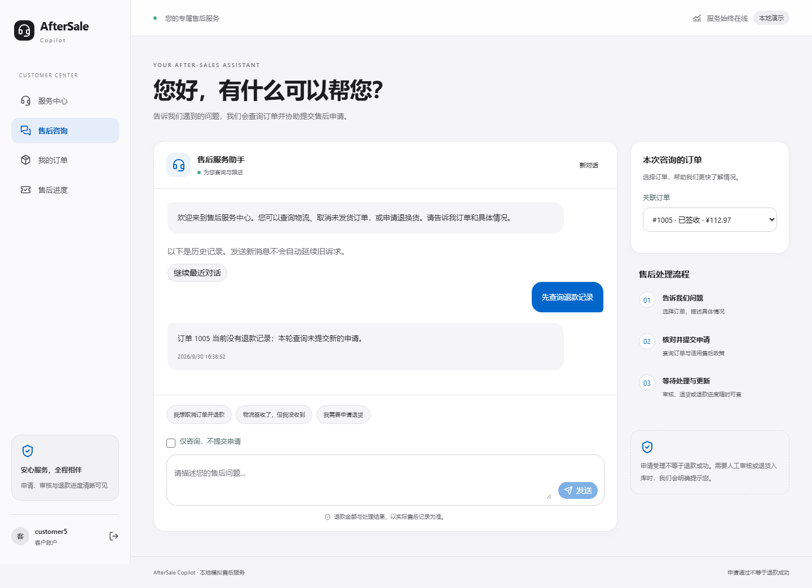

# 多轮对话与订单上下文可靠性

本轮完成显式续聊、订单范围继承、对话分叉拦截和前端旧数据隔离。没有引入 RAG、Memory、多 Agent 或新的审批/执行能力；没有调用真实模型 API。

## 解决的问题

| 问题 | 当前行为 |
| --- | --- |
| 刷新页面后自动接上最近一次诉求 | 历史仅供查看；只有点击“继续最近对话”才携带历史父消息 |
| 多段历史看起来像同一段对话 | 续聊后仅显示所选消息的祖先链，隐藏其他分支 |
| 下一轮省略订单号，模型改查另一笔本人订单 | 服务端继承已核验订单范围，其他订单工具调用被拒绝 |
| API 同时提交新订单与旧订单父消息 | 返回 `CONVERSATION_ORDER_MISMATCH`，要求开启新对话 |
| 两条消息同时从同一父消息继续 | 事务内只接受一条，其余返回 `STALE_PARENT_RUN`，不调用模型 |
| 切换订单时短暂显示上一订单的数据 | `useData` 按请求路径隔离快照，等待新结果期间不返回旧数据 |

## 对话契约

1. `parent_run_id=null` 表示新对话。父消息非空时，服务端仍检查归属和完成状态，最多加载最近六轮。
2. 未提供 `order_id` 时，继承父链已关联的订单。提供了不同订单时拒绝混用上下文。前端切换关联订单会清空父消息、新建对话，不继承旧意图。
3. 原本仅在文字中提及的订单，在工具实际通过归属校验后，若本轮只涉及一笔订单，将该订单记录到运行上，供后续继承。多订单观察不猜唯一订单。
4. 同一父消息只允许一条新后继请求。SQLite `BEGIN IMMEDIATE` 在检查后继与插入运行期间持有写锁，避免不同连接同时通过检查。不是进程内临时锁，也没有加复杂会话存储。
5. 同键同请求优先返回原运行；同键不同内容仍冲突。即使旧版本曾允许跨订单父链，已完成的相同请求也能幂等重放。新请求才接受新的上下文规则检查。
6. 续聊不复用上轮工具观察、金额、政策引用、证据或权限。明确申请仍需本轮查询和确定性校验；“仅咨询”限制由本轮请求决定。

本轮未新增 API 字段、数据库表或迁移。新增的是上述两个 HTTP 409 业务错误码，以及前端对这些错误的恢复入口。冲突时保留输入文本、重新加载历史，用户可选择继续最新对话；不会自动换一个父消息重新提交。

## 意图变更与咨询转申请

Prompt 明确：最新消息的否定和纠正优先，历史申请不等于本轮授权；不明确时先补问。客户端点击历史续聊后，默认勾选“仅咨询，不提交申请”。若要办理，取消该勾选并明确说明申请诉求即可。

工程测试验证了：旧消息要求取消，当前请求改为仅查询时，即使脚本模型尝试建单也会被阻止；从咨询转为明确申请时，需要重新查询订单与政策后才能生成 `READY` 申请，不能直接执行退款。

**这些测试不能证明模型已经理解所有自然语言纠正。** 未启用只读模式时，否定、代词、含糊的“继续”和多订单语句仍存在模型解释风险，后续必须用新的真实模型评测集验证。仅在工具核验后记录订单，不等于已经证明模型选中了用户想要的订单；显式选择关联订单仍是更可靠的边界。

## 验证与证据

| 检查 | 结果 |
| --- | --- |
| 后端完整回归 | 201 passed（本轮新增 11 项） |
| 前端组件/集成测试 | 10 passed（本轮新增 4 项） |
| 浏览器 E2E | 10 passed（新增刷新续聊及换单流程） |
| 政策 / 离线 Agent 回归 | 28/28、16/16 |
| HTTP 冒烟 | 31 项请求检查通过 |
| Ruff check / 修改文件 format | 通过 |
| 前端 lint / production build | 通过 |

浏览器、离线 Agent 和涉及模型规划的回归均使用脚本替身与隔离数据库，不计入真实模型成绩。后端仍有既存的 Starlette/AnyIO 弃用警告；上一轮记录的历史报告脚本换行格式问题不在本轮修改范围。

- [测试与版本摘要](verification/reliability-round2/checks.json)
- [浏览器运行记录](verification/reliability-round2/browser.txt)
- [浏览器结构化结果](verification/reliability-round2/e2e.json)
- [HTTP 结果](verification/reliability-round2/http-smoke.txt)
- [政策回归](verification/reliability-round2/policy-eval.json) / [离线 Agent 回归](verification/reliability-round2/agent-offline.json)

截图为真实浏览器测试页面，使用模拟业务数据。刷新后显示历史提示与续聊按钮，不自动续接。

## 保留的限制与下一步

- 线性约束只覆盖提供同一 `parent_run_id` 的请求。独立的新对话仍可并行，退款额度及重复副作用继续由现有业务服务控制。
- 历史对话最长加载六轮；页面历史列表最多 100 条，并按当前订单过滤。更早或未关联该订单的祖先可能不在当前页面列表里；本轮没有扩展长期记忆或历史归档界面。
- 已运行或已提交的请求不会因后来一句“不要了”而撤销。当前消息限制只作用于当前请求，撤回业务不在本轮范围。
- 历史冻结 Test、四份报告、数据集及之前验收记录均保持原样。**46/50 是历史冻结版本成绩，不代表当前修改后的模型成绩**；没有再次运行冻结 Test。

下一轮按计划处理运行恢复与效率：超时/断线重试、部分工具成功后的恢复、重复点击、上下文预算及可观测失败阶段。之后另建独立保留集进行真实模型评测，再以检索覆盖的实际需求决定 RAG 是否值得引入。
