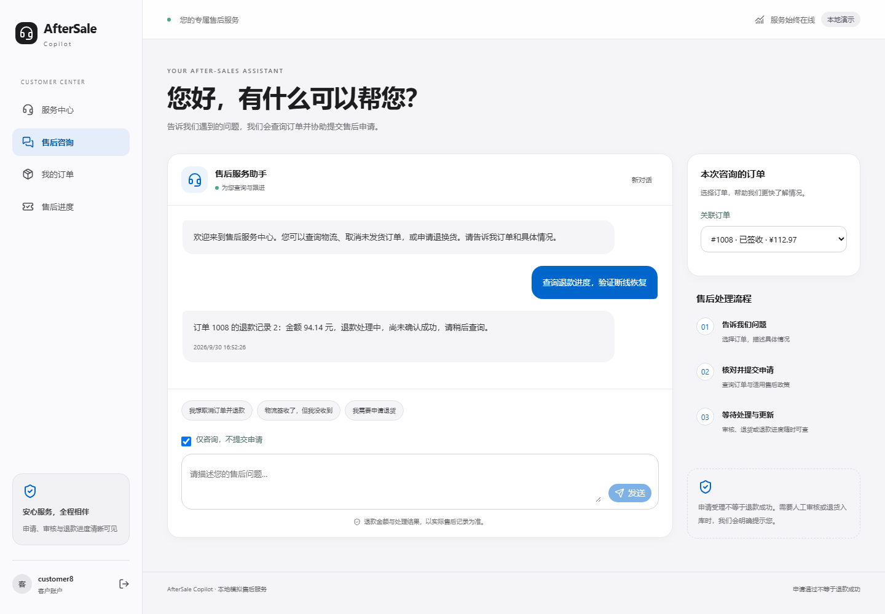

# 断线重试与中断恢复

本轮完成待确认请求保护、刷新后的原请求恢复、已落库业务记录核对，以及失败阶段可观测性。未调用真实模型 API，未引入 RAG 或复杂 Memory，也没有改变退款计算、政策判断或管理员执行权限。

## 客户端处理流程

| 情况 | 当前行为 |
| --- | --- |
| 请求发出但未收到运行编号 | 保留完整请求与原幂等键，重试同一请求 |
| 已拿到运行编号，后续查询断线 | 只 GET 原运行状态，不再次 POST |
| 结果尚未确认 | 锁定消息编辑、建议按钮、订单、咨询模式和新对话入口，保留查询原结果按钮 |
| 刷新当前标签页 | 展示“恢复待确认请求”；用户点击后恢复原请求，不自动重新发起新申请 |
| 确认运行已结束 | 清除待确认记录，解除锁定；失败但已有申请时仍展示申请卡片 |
| POST 明确返回校验/权限/冲突等 4xx | 释放待确认状态，让用户纠正请求，不自动换幂等键重发 |

使用 `sessionStorage` 按客户 ID 保存待确认的 ChatRequest 和可用的运行编号，不包含密码、模型密钥或 CSRF Token。结果确认后删除。这里是短期请求恢复记录，不是提供给模型的长期记忆。用 `useSyncExternalStore` 保持客户端存储与渲染一致，服务端渲染不会读取浏览器存储。

同步的提交锁防止同一页面快速重复事件创建新请求；服务端原有幂等检查继续承担最终保护。

## 后端恢复与审计

- 运行终结时，在同一数据库写事务内重新读取已提交工单和申请，再写入运行结果。
- 中断恢复的运行结果及未结束 Trace 一起提交，减少“运行已结束但 Trace 仍在执行”的中间状态。
- 已结束运行不会被另一次 finalization 覆盖，已结束运行不能再启动工具。恢复后的迟到模型响应不会覆盖 `TRACE_INTERRUPTED` 或启动新工具。
- 恢复只核对已落库记录，不调用模型、不重放提交、不执行退款。即使运行状态为 `FAILED`，已存在的申请仍返回真实业务状态，例如 `READY`。
- 原 `POST /agent/runs/{id}/recover` 继续仅允许管理员使用，并拒绝未超过保护时间的运行。管理员 Trace 页新增核对入口，直接复用该接口。

**恢复不是取消机制。** 时间保护不等于工作进程已停止，也不是分布式租约。管理员应先确认原工作进程已停止，再核对中断记录；已经进入执行中的工具/事务无法靠此接口强行撤销。本轮没有引入任务队列、分布式锁或真实支付执行。

## 失败阶段

`ChatResult` 新增可选字段 `failure_stage`，根据运行错误与既有调用记录派生，不需要数据库迁移。OpenAPI 与前端类型同步更新。

| 值 | 含义 |
| --- | --- |
| `model` | 与模型调用失败记录匹配，或模型未配置 |
| `tool` | 与工具调用失败记录匹配 |
| `runtime` | 编排异常、预算/超时等运行级失败或尚无法精确归类的异常 |
| `recovery` | 管理员核对中断运行 |
| `null` | 没有运行级错误 |

管理员页展示中文阶段，同时保留原 `error_type`。该字段是工程层面的粗粒度归类，不是业务 Task Success 评分；某个工具失败后若本轮成功恢复，运行级阶段仍为空，工具错误继续保存在 Trace 中。

## 验证结果

| 检查 | 结果 |
| --- | --- |
| 完整后端回归 | 209 passed（新增 8 项） |
| 前端组件/集成 | 13 passed（新增 3 项，并加强既有重试测试） |
| 浏览器 E2E | 11 passed（新增响应丢失后刷新恢复） |
| 政策 / 离线 Agent | 28/28、16/16 |
| HTTP 冒烟 | 31 项请求检查通过 |
| Ruff check / 修改文件 format | 通过 |
| 前端 lint / build | 通过 |

后端故障注入覆盖工单创建后中断、申请提交后中断、模型响应超过运行时限、管理员权限与活跃运行保护、重复恢复、迟到结果覆盖保护，以及失败阶段归类。

浏览器测试先让服务端完成请求，再拦截并丢弃响应；刷新后使用同一原始请求恢复。断言两次 POST 的完整请求一致，数据库只新增一次运行。另有组件测试验证拿到运行编号后的查询失败只重试 GET，以及失败运行仍展示已提交申请。

所有模型相关工程测试使用脚本替身，数据库隔离。未重新运行冻结 Test，未修改历史评测数据、结果或之前的验收证据。**46/50 仍是历史冻结版本成绩，不能代表本轮新版本。**

- [检查摘要与代码哈希](verification/reliability-round3/checks.json)
- [浏览器输出](verification/reliability-round3/browser.txt) / [结构化结果](verification/reliability-round3/e2e.json)
- [HTTP 验证](verification/reliability-round3/http-smoke.txt)
- [政策结果](verification/reliability-round3/policy-eval.json) / [离线 Agent 结果](verification/reliability-round3/agent-offline.json)

截图来自实际浏览器 E2E，使用模拟订单和脚本模型，不代表生产流量。

## 效率取舍与限制

1. 通过复用运行编号、原幂等键和已提交记录，避免恢复过程重复进行模型规划或业务提交。没有测量真实模型 Tokens 或延迟改善，不声明节省百分比。
2. 暂未采用自动上下文压缩、丢弃工具证据或自动重做失败申请。当前保留既有上下文预算和明确失败机制，避免在没有独立评测的情况下削弱证据约束。
3. 标签页关闭或存储被清除后，原始待确认请求可能丢失；存储不可用时只提供页面内保护。此时先检查服务端历史与售后记录，不能声称系统提供跨设备的请求恢复。
4. 断线本身不代表业务失败，`FAILED` 也不代表没有副作用。客户和管理员页面按已核验记录区分这两件事。
5. 沿用当前单机 SQLite 的事务和幂等机制，没有宣称任意外部系统的端到端 exactly-once。
6. 既有 Starlette/AnyIO 弃用警告和历史报告生成脚本的换行格式问题保留，不影响上述修改文件检查。

下一步是独立评测更新：把已知失败及故障注入案例作为回归集，另建未参与优化的新保留集，先固定业务契约、评分标准、版本和预算，再进行真实模型测试。RAG 继续等待检索覆盖与文档规模需求的证据，不在本轮引入。
