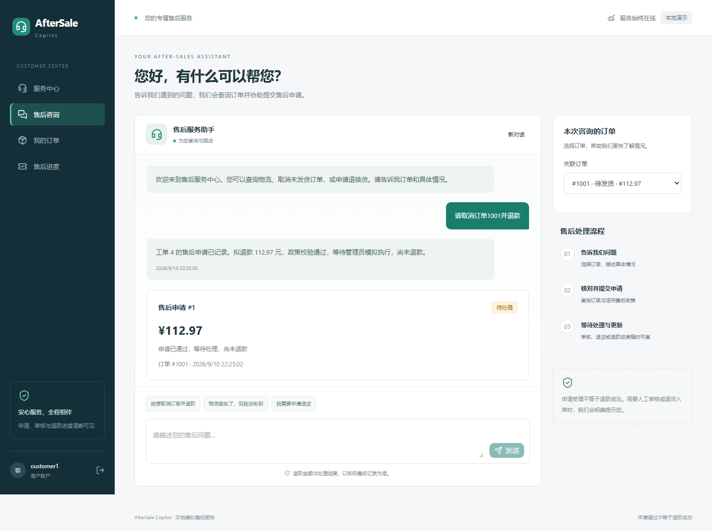
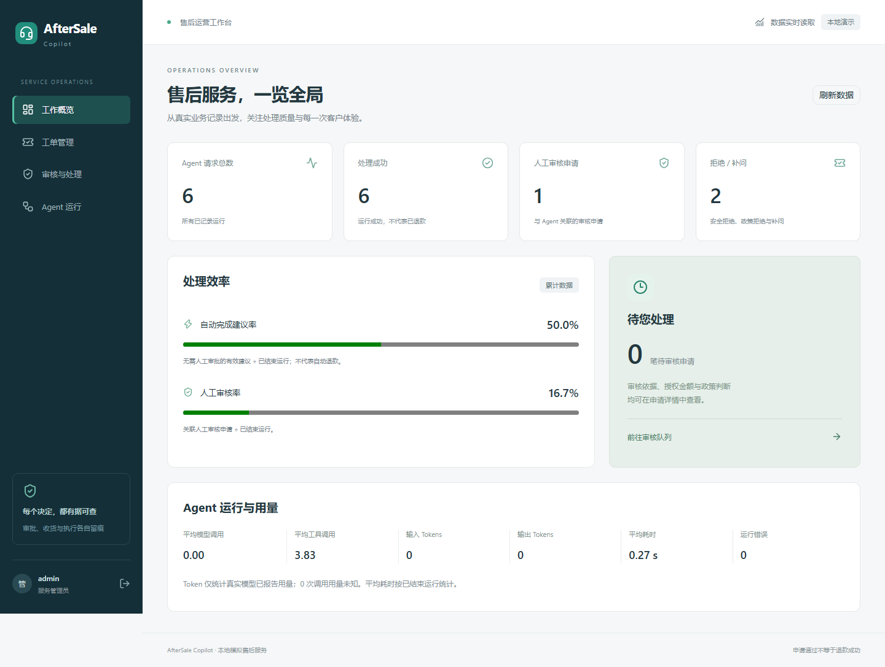

# Stage 4 交接与验收报告

验收日期：2026-09-10。范围：产品前端与真实权限。本轮已完成 Stage 4，停止于此，未进入 Stage 5。

**结论：满足本地 Web 产品演示的 Stage 4 验收要求。** 客户和管理员通过真实账户登录，页面连接 FastAPI 与数据库；原 Agent、PolicyEngine、RefundCalculator、WorkflowService 核心保持不变。后端 166/166、前端组件/集成 5/5、浏览器 E2E 8/8 通过。浏览器使用隔离脚本模型，验证真实 HTTP、权限、数据库和业务流程；本轮未追加 DeepSeek API 调用，因此不将这些测试称为新的真实模型准确率验收。

## 1. 实施步骤与交付范围

1. 阅读 Stage 3.5 交接、路线图、README 与既有路由/模型契约，保存 [Stage 4 实施计划](STAGE4_PLAN.md)。
2. 增量新增账户、会话、登录限流三表，替换演示身份头；保持原业务的权限、幂等、额度预留、证据与政策检查。
3. 新增 Portal 列表和 Dashboard 聚合，沿用 route → service → repository；管理员 Trace 采用过滤后的公开投影。
4. 实现 Next.js App Router、React、TypeScript、Tailwind CSS 与实际 shadcn/ui Button；建立同源代理及 OpenAPI 生成类型。
5. 完成客户服务中心、聊天、订单、物流与进度；管理员统计、工单、审核队列、收货/模拟执行及 Trace。
6. 迁移原测试身份到真实登录会话，保留业务断言；补充鉴权与集成测试，在隔离库进行浏览器验收并修复发现的问题。
7. 备份日常数据库、增量建表并验证旧记录一致；整理启动脚本、README、测试证据与本报告。

## 2. 页面与最终截图

视觉采用深青侧栏、浅色内容区、绿色主操作、清晰状态卡片。桌面截图为 1440px 宽，手机验证为 390px 宽；页面具备加载、空记录、可重试错误、发送中和操作中状态。

| 页面 | 地址 | 内容与截图 |
|---|---|---|
| 登录 | `/login` | 独立账号密码表单、错误反馈与身份恢复：[截图](verification/stage4/screenshots/01-login.png) |
| 客户服务中心 | `/` | 服务入口、最近订单：[截图](verification/stage4/screenshots/02-customer-home.png) |
| 售后聊天 | `/chat` | 订单选择、多轮记录、快捷诉求、申请结果：[截图](verification/stage4/screenshots/03-chat.png) |
| 我的订单 | `/orders` | 本人订单卡片、金额和订单状态；手机：[截图](verification/stage4/screenshots/10-mobile.png) |
| 订单详情 | `/orders/{id}` | 商品、金额、运单及真实时间节点：[截图](verification/stage4/screenshots/05-order.png) |
| 售后进度 | `/requests` | 工单、申请、退款金额和阶段：[截图](verification/stage4/screenshots/04-progress.png) |
| 管理员概览 | `/admin` | 数据库统计与待审入口：[截图](verification/stage4/screenshots/07-dashboard.png) |
| 工单管理/详情 | `/admin/tickets`、`/admin/tickets/{id}` | 诉求、政策、风险、规则、授权金额与管理员操作：[截图](verification/stage4/screenshots/06-admin-ticket.png) |
| 审核与处理 | `/admin/approvals` | 待审批、全部、高风险筛选及处理：[截图](verification/stage4/screenshots/11-approval-queue.png) |
| 运行列表 | `/admin/runs` | 原始运行结论、模型调用、延迟与 Trace 入口：[截图](verification/stage4/screenshots/12-run-list.png) |
| Trace Viewer | `/admin/runs/{id}` | Tool Arguments / Results、政策快照、用量和耗时：[截图](verification/stage4/screenshots/08-trace.png) |
| 权限拒绝 | 客户访问 `/admin` | 明确提示无权访问，同时 API 拒绝：[截图](verification/stage4/screenshots/09-access-denied.png) |

以上截图来自浏览器真实渲染，不是设计稿；数据来自临时测试数据库。截图中的模型为 `NOT-A-REAL-MODEL`，真实调用计数为 0，单次模型用量显示未知。Dashboard 的测试数据不代表日常 DeepSeek 数据或生产指标。





## 3. 前端目录与契约

```text
frontend/
  src/app/
    layout.tsx, globals.css
    login/, chat/, orders/, requests/
    admin/{tickets,approvals,runs}/
    api/[...path]/route.ts       同源 FastAPI 代理
  src/components/
    portal.tsx                  登录、身份恢复、导航、角色入口
    customer.tsx                订单、物流、申请、聊天
    admin.tsx                   Dashboard、审核、工单、Trace
    shared.tsx                  加载/空/错误、列表读取、JSON 展示
    ui/button.tsx               shadcn/ui 组件
    product.test.tsx            组件与 API 集成测试
  src/lib/
    api.ts                      同源请求、CSRF、401 会话失效通知
    labels.ts                   基于生成枚举的中文状态映射
    generated.ts                从 OpenAPI 生成，避免手改
  e2e/portal.spec.ts             Playwright E2E
  openapi.json, components.json
  package.json, package-lock.json
  playwright.config.ts, vitest.config.ts
```

当前安装版本：Next.js 16.3.4、React 19.2.8、Tailwind CSS 4、shadcn CLI 4.21.0。锁定依赖见 package-lock.json。`scripts/export_openapi.py` 导出 FastAPI 契约，`npm run generate:api` 更新 TypeScript。金额只格式化显示；前端不计算退款、指定政策判断或传入管理员身份。

## 4. Auth 设计与数据升级

- `auth_accounts`：唯一用户名、唯一客户绑定、customer/admin 角色、启用标记。数据库限制 customer 必须绑定用户，admin 不绑定客户。
- 密码：随机 16 字节盐，scrypt N=131072/r=8/p=1；明文不落库。创建密码长度 12–128，现有账户不被脚本静默覆盖。
- 会话：随机 32 字节令牌，数据库只存 SHA-256 摘要，有效期 12 小时。Cookie 为 HttpOnly、SameSite=Strict；本地 HTTP 下不启用 Secure，可按 HTTPS 环境配置。
- POST/PATCH 等写操作校验会话 CSRF Token 和允许的 Origin；退出撤销服务端会话。过期或停用账号会被拒绝，前端收到 401 返回登录入口。
- 登录限流：同一来源 IP 15 分钟内 10 次失败后返回 429；不存在的账户也执行密码哈希工作。当前同源代理下为本机共享来源限制。
- `Principal` 的 user_id、角色和审计 actor 全部来自数据库会话。修改 URL、JSON 或旧 X-Demo 身份头均不能切换本人身份。
- 普通客户不得访问 Dashboard、审批、执行、收货、Trace；管理员操作沿用原服务并记录当前真实账号 actor。Agent 工具白名单没有新增任何审批/执行能力。
- Next.js 只代理固定后端地址及允许路径，保留 Cookie/CSRF，API 响应 no-store；密钥不进入前端变量或构建产物。

日常库已从 **14 表升级至 17 表**，旧记录逐表计数与哈希一致，包括 run_id=2。备份位于 `data/backups/before-stage4-20260910T142114073811Z.db`；[迁移证据](verification/stage4/database-upgrade.json)。没有重置订单、退款或历史轨迹，也没有替用户设置固定密码。

与 Stage 3.5 优化源码包逐文件比较，整个 `backend/app/agent/`、业务服务、PolicyEngine、RefundCalculator、WorkflowService、原实体模型和仓储保持一致。修改集中于身份依赖、路由接入、配置、建表注册、应用装配和命令行调用方式：[源码比较](verification/stage4/source-comparison.json)。

## 5. Customer Portal 与 Admin Console

客户可查本人订单、详情、物流和退款记录；物流 Timeline 仅使用已有创建、支付、发货、签收时间，不虚构运输网点。聊天按用户和订单读取服务端历史，以 parent_run_id 续聊；发送状态阻止重复点击，同一次不确定重试复用幂等键，RUNNING 结果轮询。刷新后已提交记录仍在数据库中。

申请状态覆盖 READY、WAITING_APPROVAL、WAITING_RETURN、SUCCESS、REJECTED，并补充 BLOCKED/FAILED。READY 提示“申请已通过，等待处理，尚未退款”；只有退款执行 SUCCESS 才显示“退款成功（模拟）”。物流调查和换货即使执行成功也采用各自文案，不能显示为已退款。

管理员可分页浏览工单、申请和运行；待审批与高风险筛选在后端执行。详情展示 Policy Decision、Rule Codes、Risk Level、授权金额、政策版本及快照。批准/拒绝需要说明，收货需要核验说明，模拟执行有明确确认弹窗；按钮只按状态显示，最终合法性仍由既有 WorkflowService 校验。

Trace 展示工具名称、参数、结果、状态、延迟和每轮模型用量。HTTP 投影递归过滤 system 消息、system_prompt 与 reasoning_content；本地原始追踪继续用于受控排查。运行列表保留 Agent 当时结论，审批后的当前申请状态从 ActionRequest 读取，两者含义不同。

## 6. API 变更

| API | 权限与用途 |
|---|---|
| `POST /auth/login` | 本机账号登录，设置会话 Cookie，返回 CSRF |
| `GET /auth/me` | 当前账号、角色、客户绑定、CSRF |
| `POST /auth/logout` | 撤销会话，需要 CSRF |
| `GET /portal/actions` | customer 本人 / admin 全部；risk、status、limit、offset |
| `GET /portal/runs` | customer 本人 / admin 全部；order_id、limit、offset |
| `GET /portal/dashboard` | admin，真实数据库累计指标 |
| 现有 `/users`、`/orders`、`/tickets`、`/actions` 等 | 复用原路由和业务服务，身份改为真实会话 |
| 现有审批、退货收货、模拟执行、Trace | admin 强制校验；Trace 增加输出过滤 |

这是身份协议的有意升级：旧演示头不再认证；脚本调用必须先登录并带会话及写操作 CSRF。聊天服务从会话注入 user_id，保留原请求金额/证据/幂等约束。OpenAPI 快照在 `frontend/openapi.json`，完整运行接口可在 FastAPI `/docs` 查看。

Dashboard 口径：

| 指标 | 数据和公式 |
|---|---|
| 总请求/成功/错误 | AgentRun 总数 / status=SUCCESS / status=FAILED |
| 人工审批数 | AgentRunDetail 关联到 Approval 的运行条数，包含后来已审批的历史记录 |
| 拒绝/补问 | outcome 为 REFUSED、POLICY_DENIED、NEED_MORE_INFO 的条数 |
| Automation Rate | READY、WAITING_RETURN、LOGISTICS_PENDING 运行数 ÷ 已结束运行数 |
| Human Review Rate | 关联人工审批的运行数 ÷ 已结束运行数 |
| 平均 LLM/Tool Calls | AgentRun.llm_calls 总和 / 请求数；ToolCall 记录数 / 请求数 |
| Input/Output Tokens | 仅 is_live=true 的 ModelCall 已报告用量之和，另计未知用量调用数 |
| 平均 Latency | 已结束运行的 latency_ms 总和 ÷ 已结束运行数 |
| 待审批 | Approval.status=PENDING 数量 |

分母为 0 时返回 0。“成功运行”包含正常补问/政策拒绝；Automation Rate 是无需人工审批的有效建议占比，**不代表资金自动退回率**。UI 已说明上述区别，不把未知真实用量默认为已知零值。

## 7. E2E 与测试结果

| 场景 | 浏览器验证结果 |
|---|---|
| A 普通未发货取消 | customer1 / 1001 → READY，112.97 元；显示尚未退款，刷新保留申请 |
| B 高金额退款 | customer6 / 1006 → WAITING_APPROVAL；admin 批准 → READY → 模拟执行 SUCCESS，2512.98 元；待审/高风险页面可见 |
| C 签收未收到 | customer10 / 1010 → LOGISTICS_PENDING；建立调查建议、不退款；签收 Timeline 可见 |
| D 信息不足 | customer4 未选订单 → NEED_MORE_INFO；补充 1014 后续聊保留 parent_run_id，按订单状态得到 POLICY_DENIED |
| E 越权 | customer2 读订单 1001 返回 403；伪造旧 admin 头不能提权 |
| F 客户访问 Admin | 审批与 Trace API 返回 403，管理页面显示无权访问；未登录返回 401 |
| 补充：退货 | customer3 / 1003 部分退货 → WAITING_RETURN；admin 确认收货 → 模拟执行 SUCCESS |
| 补充：页面和会话 | Dashboard/运行列表/Trace 可读；390px 无页面横向溢出；退出后 me 返回 401 |

最终 Playwright **8/8 通过**，Chromium，生产 Next.js 构建，真实 Uvicorn/FastAPI，临时 SQLite，串行运行。A–F 被归入测试文件的 8 个测试中；测试用户与密码仅存在测试 fixture 和临时库，不能用于日常登录。[机器结果](verification/stage4/e2e.json)、[服务日志](verification/stage4/servers.log)。

| 检查 | 最终结果 | 证据 |
|---|---|---|
| 后端 pytest | 166/166，0 失败；原 152 + Auth/Portal 14 | [日志](verification/stage4/pytest.txt)、[JUnit](verification/stage4/pytest.xml) |
| Ruff 检查/格式、pip check | 全通过 | [后端汇总](verification/stage4/summary.json) |
| 确定性政策案例 | 28/28 | [结果](verification/stage4/policy-eval.txt) |
| 离线 Agent 案例 | 16/16 | [结果](verification/stage4/agent-eval.txt) |
| 实际 HTTP 冒烟 | 未配置模型 31/31；脚本模型 31/31 | [结果一](verification/stage4/http-smoke.txt)、[结果二](verification/stage4/agent-http-smoke.txt) |
| 前端组件/集成 | 5/5，覆盖业务状态文案、登录错误、CSRF 请求 | [日志](verification/stage4/frontend-tests.txt) |
| ESLint | 通过 | [日志](verification/stage4/frontend-lint.txt) |
| Next.js 生产构建及 TypeScript | 通过 | [日志](verification/stage4/frontend-build.txt) |

原测试的身份构造改为真正的账户/会话，没有用依赖覆盖绕开鉴权；保留原业务断言，并将废弃演示角色头的预期改为不认证。Stage 3.5 中文 PowerShell 真实 HTTP 往返测试继续通过。仅剩第三方 Starlette/anyio 的弃用提示，不影响断言或请求。

验收发现并修复：

- 运行与详情有两个外键路径，列表隐式 JOIN 导致多轮历史查询 500；明确 run_id 连接并增加非空数据/用户隔离回归。
- 补问文本和时间戳共用节点影响精确浏览器定位；拆为独立语义节点，续聊检查通过。
- Windows PowerShell 5.1 在未加载模块时不能解析强制 WebRequestSession 参数类型；保留会话对象传递，去掉预加载类型要求，UTF-8 往返恢复。
- 测试查询误用 getByRole 的 exact 类型参数，TypeScript 构建拒绝；改为该 API 支持的名称匹配。
- 审批定位不再只搜索前 100 条；逐页找到对应申请。登录失效统一回到登录，旧身份头无法作为替代入口。

首次浏览器失败记录保留在 [e2e-initial.json](verification/stage4/e2e-initial.json)，最终状态以 e2e.json 和上述最终汇总为准。

## 8. 现在如何启动和演示

进入项目目录，先运行 `.\.venv\Scripts\python.exe scripts/setup_accounts.py` 在本机设置各账号独立密码。默认创建 customer1/3/4/6/10 和 admin；已有账号不会覆盖。然后分别在两个终端运行 `scripts/start.ps1` 与 `scripts/start_frontend.ps1`，打开 **http://127.0.0.1:3000**。完整安装、模型配置与命令见 [README](../README.md)。

推荐演示顺序：

1. customer1 登录 → 订单 1001 → 售后咨询取消；展示政策授权金额、READY 与“尚未退款”。日常库已有历史申请时先展示原记录，避免为了演示强行重复退款。
2. customer6 → 高额订单 1006 发起取消 → 查看待审核；切换 admin → 待审批/高风险 → 核实规则和金额 → 批准 → 模拟执行 → 查看 SUCCESS。
3. customer10 → 订单 1010 → 签收未收到；展示物流节点与调查建议。
4. customer4 → 不选订单询问取消 → 补充订单号继续对话。
5. 普通客户尝试 `/admin` 和他人订单；展示 UI 与后端双层拒绝。
6. admin → Dashboard → Agent 运行 → Trace；解释工具、政策、用量与“运行结论/当前申请状态”的区别。

如需完全重新演示，可在**后端终端**设置 `$env:ASC_DATABASE_URL='sqlite:///./data/stage4-demo.db'`，执行 init-db、seed、setup_accounts 后启动；这是独立新文件，不重置日常数据库。再次运行 seed 不会清空已有数据。真实聊天会使用本地 `.env` 的 DeepSeek 配置并产生实际调用；自动 E2E 始终使用另一临时库与脚本模型。

## 9. 已知限制

- 定位是本机运行的 V1 产品：未部署公网、未对接支付、仓库或电商平台，所有执行为模拟。HTTPS、跨机器部署与多实例限流未纳入本轮。
- 没有公共注册、OAuth、密码找回/修改页面、会话管理面板或定期清理过期会话任务。账户通过本机脚本开通；没有预置生产密码。
- Stage 4 没有追加真实 DeepSeek 端到端浏览器评测。真实模型能力证据来自 Stage 3.5 的 5 个代表场景，脚本 E2E 不评价自然语言准确率。
- 对话不做流式输出；一次调用等待后端结果，超时/模型失败显式提示。新对话不引入复杂 Memory；当前聊天历史最多读取 100 条，工单关联运行也展示最近 100 条运行中的匹配项。普通列表有分页。
- 物流只展示种子数据已有节点，订单列表使用通用商品图标，详情读取真实商品名称；未接外部商品图片或物流查询。
- 浏览器自动验收为 Chromium，检查桌面与手机尺寸；尚未做 Safari/Firefox、屏幕阅读器专项验收或大规模负载测试。
- Dashboard 是累计数据，没有趋势时间窗、SLA 或质量评分；这些指标尚无对应产品定义，未编造。

## 10. Stage 5 建议（本轮不执行）

优先扩大冻结真实模型评测与对抗变体，覆盖多轮歧义、超时重试、证据不足和并发重复提交；单独统计 Task Success、权限/政策错误、金额正确性、成本和延迟。随后完善账号生命周期、分页历史/筛选、跨浏览器与可访问性，再考虑录制可复现演示和作品集说明。对外部署应先制定 HTTPS、日志保留和数据保护方案。本轮没有引入 Multi-Agent、MCP、复杂 Memory，也未重写 Agent 核心。

## 11. 推荐阅读代码的顺序

1. [README](../README.md) 与本报告：先跑通页面，再理解状态和权限边界。
2. [core/enums.py](../backend/app/core/enums.py)、[models/entities.py](../backend/app/models/entities.py)：订单、申请、审批和执行状态。
3. [services/policy.py](../backend/app/services/policy.py)、[calculator.py](../backend/app/services/calculator.py)、[workflow.py](../backend/app/services/workflow.py)：政策、金额和资金副作用约束。
4. [models/auth.py](../backend/app/models/auth.py)、[services/auth.py](../backend/app/services/auth.py)、[api/dependencies.py](../backend/app/api/dependencies.py)：身份如何落库并强制保护接口。
5. [api/auth_routes.py](../backend/app/api/auth_routes.py) 与 [repositories/auth.py](../backend/app/repositories/auth.py)：登录链路与会话读取。
6. [agent/tools.py](../backend/app/agent/tools.py)、[runtime.py](../backend/app/agent/runtime.py)：模型允许做什么、如何进入既有业务层。
7. [repositories/portal.py](../backend/app/repositories/portal.py)、[services/portal.py](../backend/app/services/portal.py)、[api/portal_routes.py](../backend/app/api/portal_routes.py)：列表作用域和 Dashboard 聚合。
8. [frontend/src/lib/api.ts](../frontend/src/lib/api.ts) 与 [代理路由](../frontend/src/app/api/[...path]/route.ts)：Cookie/CSRF 同源请求。
9. [portal.tsx](../frontend/src/components/portal.tsx)、[customer.tsx](../frontend/src/components/customer.tsx)、[admin.tsx](../frontend/src/components/admin.tsx)：从登录到实际业务操作。
10. [Auth/Portal 测试](../backend/tests/test_auth_portal.py)、[组件测试](../frontend/src/components/product.test.tsx)、[E2E](../frontend/e2e/portal.spec.ts)：看实现如何被验证，以及脚本模型的明确边界。

**交接状态：Stage 4 已完成；测试服务器已停止。下一步由使用者设置本机密码并按 README 启动演示，Stage 5 等待后续授权。**
